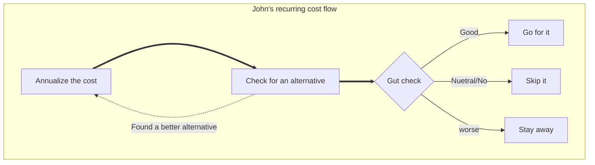
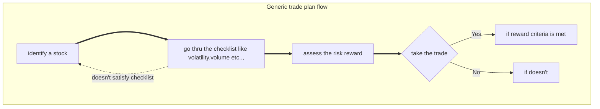
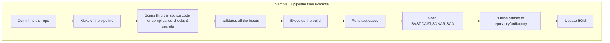

### John's workflow session notes

What is a workflow?

Any activity in our daily life where we have to make series of decisions to execute something templatized, to a structure that we can execute it like an algorithm to improve our effiency and accuracy while avoiding mental fatigue.

##### Acronynm SAPS:
* Squence
* Actions
* Purpose
* Signal

`SQUENCE of ACTIONS for a specific PURPOSE executed on a SIGNAL/trigger`

------
An example of what can be a workflow that we can relate in our day to day life

------
The workflow I can relate to was a trading strategy where you have to meticulously follow same series of steps for everyday for success and any deviations could lead to more probabilty of losses. 

-----
At work this can applied to lot of stuff. Like CI/CD pipelines, AWS Step Functions, Decisions rules which are similar to the workflow. And the event drive design perfectly fits into this. 

------

While I still can't completely comprehend on how to put this to use in my daily routine, this definitely helps me in streamlining my work proccesses where I have a hybrid approach using pipelines/automation and some manual effort for completing a task. This helps make sure that I wouldn't miss a step. Also can help with troubleshooting flow where multiple systems are interracted in a series/routine. 
